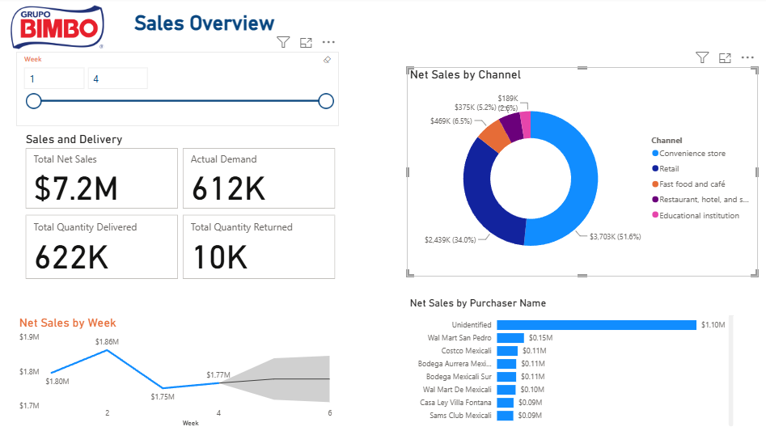
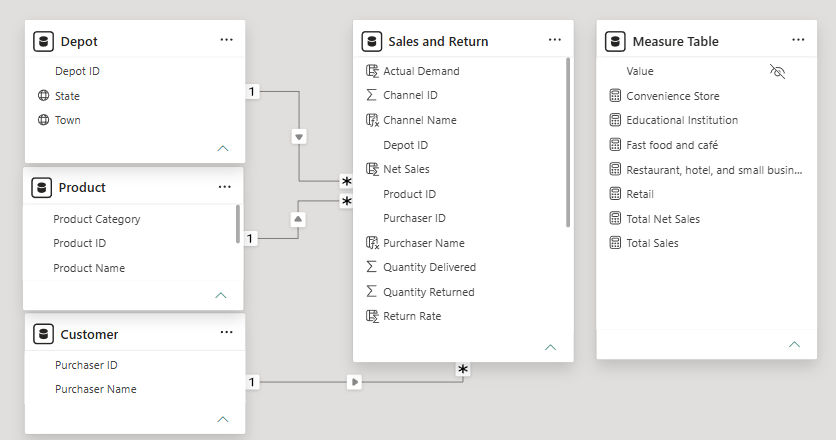
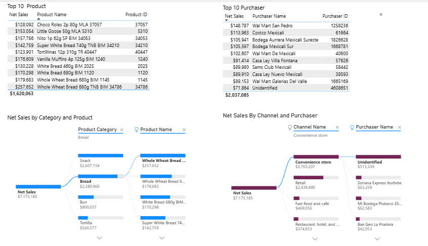
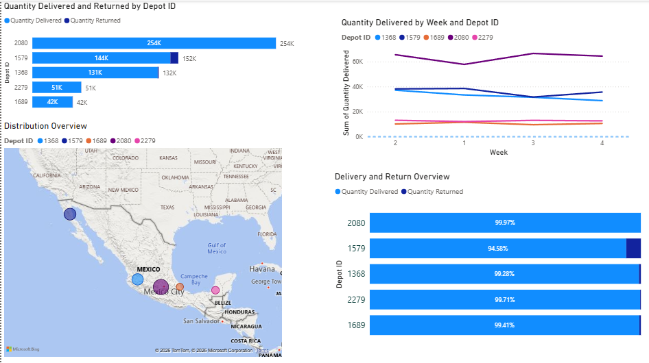
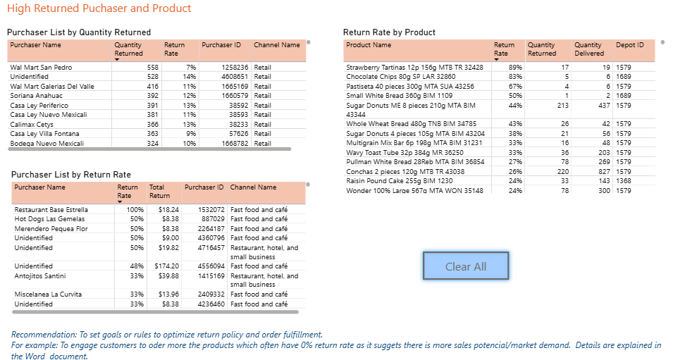

# Grupo Bimbo Sales & Returns Analytics Dashboard

**Power BI Sales & Returns Analytics | Business Intelligence Portfolio Project**

## Project Overview

This project showcases a comprehensive **Power BI analytics solution** developed for Grupo Bimbo, a global leader in the baking industry. The interactive dashboard provides clear visibility into sales performance, distribution efficiency, product returns, and customer behaviour across multiple channels and depots.

The solution enables data-driven decision making by identifying revenue drivers, operational inefficiencies, **maximizing sales potential** for low-risk products, and highlighting opportunities to reduce return-related costs.

**Key Technologies**: Power BI, Power Query, DAX, Star Schema Data Modelling

**[View Full Business Report](Business_Report.pdf)**

## Business Challenge

Grupo Bimbo manages complex operations involving multiple sales channels (Retail, Convenience Stores, etc.), distribution depots, and purchasers. Management required better insights to:
- Track sales performance and key revenue drivers
- Evaluate distribution effectiveness
- Monitor and reduce product returns
- Identify high-value customers and growth opportunities

## Technical Approach

### Data Preparation (Power Query)
- Conducted thorough data quality checks (missing values, duplicates, data type validation)
- Standardised column names and formats
- Transformed raw data into a clean **star schema** model
- Created separate dimension tables for Customer, Product, and Depot

### Data Model

- **Fact Table**: Sales and Return (central transaction table)
- **Dimension Tables**: Customer, Product, Depot
- **Supporting Table**: Measure Table (for organised DAX measures)
- Implemented proper one-to-many relationships for optimal performance

### Key DAX Measures
- Total Net Sales, Actual Demand, Quantity Delivered
- Quantity Returned, Return Rate
- Channel and customer performance metrics
- Time intelligence (trends and forecasting)

**Important Note**: Some purchaser records were labelled as **"Unidentified"**. These records were **retained** (rather than removed) as they represented legitimate sales transactions and contributed meaningful revenue.

## Dashboard Pages

### 1. Sales Overview

- Executive KPI cards: **$7.2M** Total Net Sales, **612K** Actual Demand, **622K** Quantity Delivered
- Sales breakdown by channel (donut chart)
- Weekly sales trend with forecast
- Top purchasers

**Key Insight**: Retail and Convenience Store channels account for approximately **85%** of total revenue.

### 2. Sales Analysis

- Top 10 Products and Top 10 Purchasers
- Product category performance
- Sankey diagram showing flow from channels to purchasers

### 3. Distribution Overview

- Depot performance ranking and delivery vs returns
- Geographic distribution map (Mexico focus)
- Weekly delivery trends by depot

### 4. Return Analysis

- High-return purchasers and products
- Return rate analysis
- Actionable recommendations for return policy optimisation

## Key Findings
- Strong sales concentration in Retail and Convenience Store channels (~85% of revenue)
- A small number of products and purchasers drive the majority of sales
- Several high-value “Unidentified” purchasers represent significant untapped potential
- Specific depots, products, and purchasers show elevated return rates

## Recommendations

1. **Improve Demand & Delivery Alignment**  
   Tighten ordering logic for high-return products to better match actual demand.  
   *Expected benefit*: Reduced waste, lower logistics costs, and improved inventory turnover.

2. **Maximize Sales Potential for Low-Risk Products**  
   Products with consistently **0% return rates** represent reliable growth opportunities.  
   Proactively engage purchasers through targeted communication, volume incentives, or joint forecasting.  
   *Expected benefit*: Higher revenue with minimal additional return risk.

3. **Develop High-Value "Unidentified" Customers**  
   Convert ad-hoc high-value purchasers into long-term accounts.  
   *Expected benefit*: Increased customer retention and repeat business.

4. **Strengthen Return Policies**  
   Implement tiered return controls for high-risk, low-value purchasers.  
   *Expected benefit*: Significant reduction in return-related costs.

## Technologies Used
- **Power BI Desktop** – Dashboard development and interactivity
- **Power Query** – Data cleaning and transformation
- **DAX** – Advanced calculations and measures
- **Star Schema** – Professional data modelling

## Getting Started
1. Clone the repository
2. Open `powerbi/Grupo_Bimbo.pbix`
3. Explore the interactive dashboards
3. Open `powerbi/Grupo_Bimbo.pbix` (if available)
4. Explore the interactive dashboards
